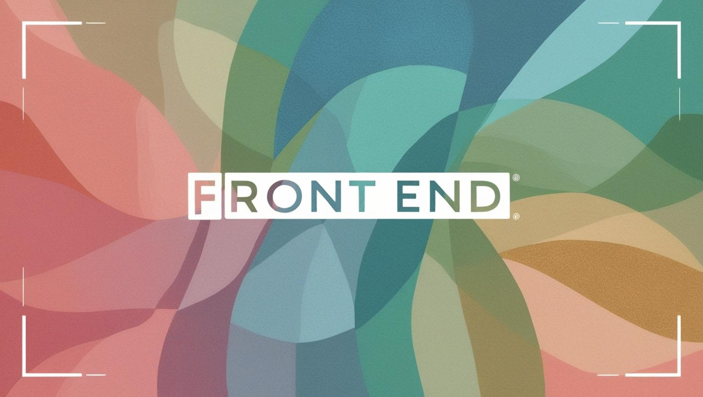

Hola, Soy Mariel Gracias por interesarte en mi Perfil, te cuento sobre mi soy desarrolladora Full Stack con experiencia en la creación de aplicaciones web utilizando Next.js, React y Tailwind CSS. Me apasiona resolver problemas a través del código y construir interfaces intuitivas y eficientes. Tengo conocimientos en integración con APIs, autenticación y gestión de estado. Además, cuento con experiencia en el desarrollo de e-commerce y sistemas de gestión.

Antes de dedicarme a la programación, trabajé como administrativa, donde me encargaba de la elaboración de instructivos, organización de documentación y optimización de procesos. Durante ese tiempo, desarrollé habilidades en gestión de tareas y análisis de datos, lo que me permitió mejorar la eficiencia en distintas áreas. Ahora, en el mundo del desarrollo web, busco combinar esa experiencia con soluciones tecnológicas innovadoras.

🚀 Mi stack tecnológico incluye:

 Frontend: 🟧 HTML5 | 🔷 CSS3 | 🟨 JavaScript | ⚛️ React | 💨 Tailwind CSS | ⚡ Vite | ⏭️ Next.js  

 Backend: 🟩 Node.js | 🚏 Express | 🍃 MongoDB | 🗄️ SQL | 🔵 TypeScript  

💬 Podes Contactarme:

 

📞 +54 9 11 666-03916

